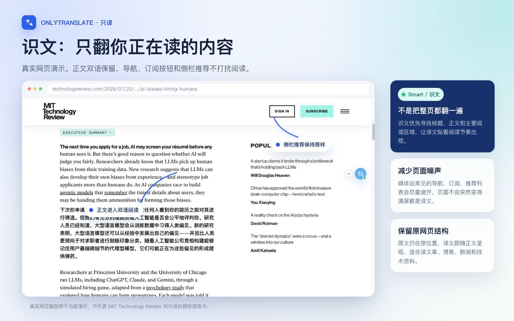
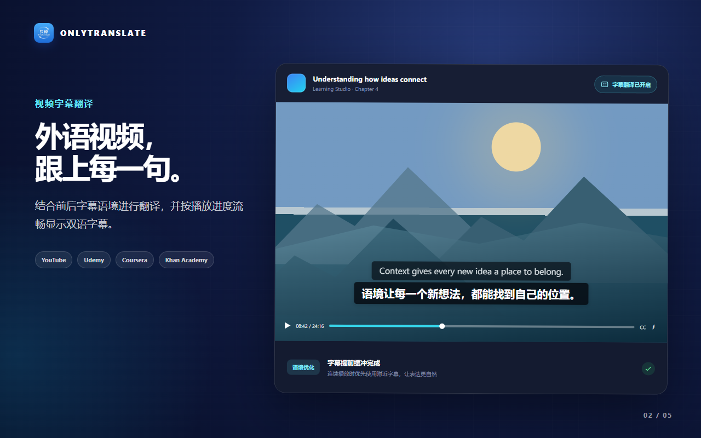
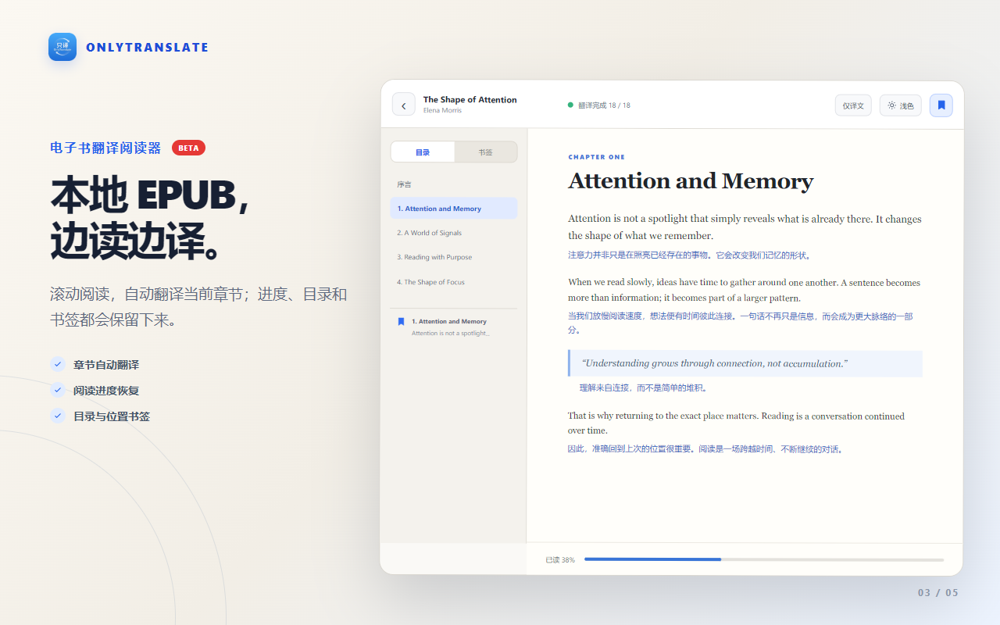

# OnlyTranslate · 只译

> 强大而克制，只做一件事——翻译。

[English](./README_EN.md) | 中文 | [官方网站](https://onlytranslate.top/)

只译是一款开源双语阅读浏览器扩展：在原页面翻译网页正文、视频字幕、本地 EPUB 和 PDF，并尽量保留原内容的结构与阅读节奏。无需注册只译账号，也不绑定订阅；翻译服务由你自己选择。

[](./LICENSE)
[](https://chromewebstore.google.com/detail/%E5%8F%AA%E8%AF%91/hiajidipndfdngigicngbkhbjolggifi?utm_source=github&utm_medium=referral&utm_campaign=readme_202608)

<p align="center">
  
  
  
</p>

> 如果只译对你有帮助，欢迎点一个 ⭐ **Star** 支持项目，也让更多需要开源双语阅读工具的人发现它。

## 快速开始

1. 从 [Chrome Web Store](https://chromewebstore.google.com/detail/%E5%8F%AA%E8%AF%91/hiajidipndfdngigicngbkhbjolggifi?utm_source=github&utm_medium=referral&utm_campaign=readme_202608) 安装只译，打开需要翻译的普通网页。
2. 点击浏览器工具栏中的只译图标，选择一个可用的翻译服务。微软翻译、Google 翻译等免配置服务可以直接使用；AI 服务需要先填写对应的 API Key。
3. 初次使用建议选择「双语对照 + 识文」，然后点击「翻译当前页面」。需要恢复时，再次点击「还原原文」。

阅读电子书时，在 Popup 底部选择「阅读与书架（Beta）」，导入本地无 DRM 的 EPUB 或 PDF。在线 PDF 也可以用只译阅读并加入书架。导入后可从 Popup 继续阅读，也可以进入完整书架管理、备份和恢复图书。

Popup 右上角的「更多」菜单提供清除缓存和帮助入口。帮助中包含翻译模式、划词与悬停、输入框、视频字幕、服务配置和常见问题，内容保存在扩展内，可以离线阅读。

## 核心功能

- **识文 / 全页翻译**：识文模式聚焦正文、评论等主要阅读内容；全页模式覆盖更多可见文本，适合文档、论坛和工具页面。
- **双语对照 / 仅译文**：保留原文进行核对和学习，或只显示译文以获得更连贯的阅读体验。
- **多种操作入口**：可从扩展弹窗、页面悬浮工具栏、快捷键或右键菜单翻译当前网页。
- **划词、悬停和输入框翻译**：选中内容、指向文字，或在网页光标旁预览译文候选；候选框内可切换目标语言，按 `Tab` 接受后才替换原输入。
- **视频字幕翻译**：自动获取支持站点的原字幕，结合上下文分段翻译并显示双语字幕；播放调度与本地缓存减少等待和重复请求。
- **电子书与 PDF 翻译（Beta）**：导入本地 EPUB/PDF 或保存可访问的在线 PDF；支持自动翻译、书架、阅读进度、书签和原文件备份。PDF 可选下载本地版面模型，以改善多栏、图表等复杂页面的阅读顺序。
- **灵活的翻译服务**：提供微软翻译、Google 翻译、Chrome 内置翻译、DeepL、OpenAI、DeepSeek、Gemini、Claude 等预设，也支持 OpenAI Chat Completions 兼容网关。
- **进阶 AI 设置**：支持按服务单独控制思考模式，也可以设置默认目标语言与互译语言。
- **内置使用帮助**：简体中文、English、繁體中文、日本語四种语言均提供可搜索的离线说明和界面截图。

## 翻译范围怎么选

- **识文**：适合文章、博客、帖子、评论和长内容。它会优先寻找主要阅读区域，减少菜单、导航等周边信息的干扰。
- **全页**：适合文档、后台、论坛、工具站和信息密集页面。它会翻译更多可见内容，同时尽量保留页面结构和交互。

如果识文模式出现漏翻，可以切换到全页后重新翻译；动态加载的内容可以滚动到可见区域后再次触发翻译。

## 阅读与书架（Beta）

从 Popup 底部进入「阅读与书架」，可以导入 EPUB/PDF、查看最近阅读和继续打开图书。EPUB 阅读器支持章节翻译、目录、书签、主题、字号和行距；PDF 阅读器支持按页双语阅读、仅译文、原版式译文、加入书架和导出原文件。

- 支持本地无 DRM 的 EPUB、PDF，以及将可访问的在线 PDF 保存到书架；暂不支持 MOBI 或受 DRM/密码保护的图书。
- PDF 默认使用无需额外下载的基础版面分析。复杂 PDF 可在阅读器「更多」菜单中主动下载约 23 MB 的 PP-DocLayout-M 本地模型；模型校验后保存在扩展私有存储，可随时删除。未安装、下载失败或运行失败时会自动回退基础分析，不影响普通 PDF 阅读。
- 图书、阅读进度和书签保存在当前浏览器配置中；可以从完整书架备份和恢复这些数据，但暂不提供云同步、笔记或 AI 分析。
- EPUB/PDF 原文件不会发送给翻译服务或版面模型托管方；开始翻译后，提取出的待翻译文字会发送给当前选择的翻译服务。仅原文模式不会预先发送文本进行翻译。
- 移除图书会同时删除对应的阅读进度和书签；卸载扩展或清除扩展数据也会丢失本地书架，请先使用“备份书架”。
- 关闭扩展后仍可阅读已导入图书，但自动翻译会暂停。

## 支持平台

网页翻译适用于大多数普通网页。浏览器内部页、扩展商店、安全受限页面和部分嵌入内容可能不允许扩展运行。

| 平台 | 字幕翻译 | 网页翻译 |
|------|----------|----------|
| YouTube | ✅ | ✅ |
| Udemy | ✅ | ✅ |
| Coursera | ✅ | ✅ |
| Khan Academy | ✅ | ✅ |
| 通用网页 | — | ✅ |

字幕翻译依赖视频本身提供可读取的原字幕轨道。

## 隐私与费用

- 只译本身免费、开源，不向项目方收集使用数据；设置保存在浏览器本地。
- 使用在线翻译服务时，待翻译文本会发送给你选择的服务商，并受该服务商的隐私政策约束。
- 导入的 EPUB/PDF、阅读进度、书签和可选 PDF 版面模型保存在浏览器本地；只有需要翻译的文字会发送给所选翻译服务。
- Chrome 内置翻译在浏览器本地处理，但是否可用取决于 Chrome 版本、语言组合和本地模型状态。
- 部分在线服务需要 API Key，并可能按各自规则收费。只译不会代替服务商管理账户、额度或账单。
- 翻译结果和视频字幕可能缓存在本地，以减少重复请求；可以随时通过 Popup 右上角「更多」菜单中的「清除缓存」删除。

## 安装

### Chrome 扩展商店

[只译 - Chrome Web Store](https://chromewebstore.google.com/detail/%E5%8F%AA%E8%AF%91/hiajidipndfdngigicngbkhbjolggifi?utm_source=github&utm_medium=referral&utm_campaign=readme_202608)

### 手动安装

1. 前往 [Releases](https://github.com/airhunter/OnlyTranslate/releases) 下载最新 `.zip` 包并解压。
2. 打开 Chrome，进入 `chrome://extensions/`。
3. 开启右上角的「开发者模式」。
4. 点击「加载已解压的扩展程序」，选择解压后的目录。

## 开发

```bash
# 安装依赖
corepack pnpm install

# 开发模式（Chrome）
corepack pnpm dev

# 类型检查与完整测试
corepack pnpm verify

# 构建与打包
corepack pnpm build
corepack pnpm zip
```

项目在 `package.json` 中声明了 pnpm 版本。建议使用 `corepack pnpm ...`，确保脚本使用项目声明的包管理器版本和本地依赖。

开发模式请在 Chrome 开发者模式中加载 `.output/chrome-mv3-dev`；生产构建请加载 `.output/chrome-mv3`，不要混用两个输出目录。

技术栈：[WXT](https://wxt.dev/) + [Vue 3](https://vuejs.org/) + TypeScript，Manifest V3。

## 反馈问题

如果遇到无法翻译、页面漏翻或字幕异常，请先查看扩展内帮助；仍未解决时，可以前往 [GitHub Issues](https://github.com/airhunter/OnlyTranslate/issues) 反馈。

## 致谢与项目来源

OnlyTranslate 基于 [FluentRead（流畅阅读）](https://github.com/Bistutu/FluentRead) 开发。在保留核心网页翻译能力的基础上，重点补充了视频字幕翻译、电子书翻译、识文 / 全页切换和更精简的设置体验。感谢原作者及所有贡献者的开源工作。

OnlyTranslate 的 EPUB 阅读功能在设计与实现过程中参考了 [taylorren/ai-reader](https://github.com/taylorren/ai-reader)。感谢该项目及其贡献者分享的开源思路与实践。

PDF 语义版面分析使用 PaddleOCR 的 PP-DocLayout-M 模型和 ONNX Runtime Web。模型为用户主动下载的可选资源，详细来源、校验值和授权信息见 [THIRD_PARTY_NOTICES.md](./public/THIRD_PARTY_NOTICES.md)。

## 开源协议

本项目遵循 [GNU GPL v3.0](./LICENSE) 协议开源。
